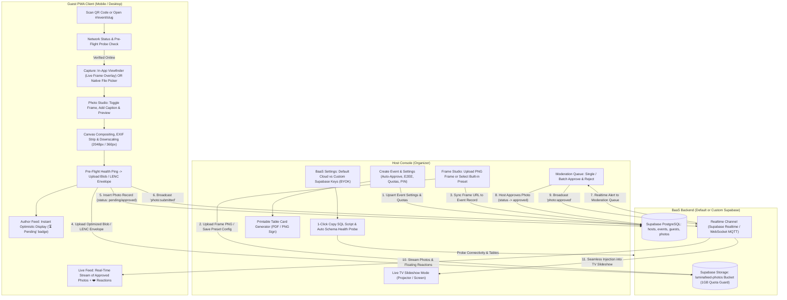

# 📸 LuminaFeed — Real-Time Event Photo Sharing PWA

[-blue)](CHANGELOG.md)
[](#-rebuild-roadmap-v001--v010)
[](https://opensource.org/licenses/MIT)
[](https://svelte.dev/)
[](https://supabase.com/)
[](https://web.dev/progressive-web-apps/)
[](https://ko-fi.com/deidi0)

> **LuminaFeed** is an **Online-First Progressive Web App (PWA)** for real-time event photo sharing. Guests join instantly via QR code to capture photos with **host-customized photo frames**, stream directly to cloud storage, interact with **live reactions and captions**, and watch approved memories appear instantly on a **full-screen TV slideshow**. Organizers can use the default cloud backend or bring their own Supabase keys (BYOK) with automated 1-click database setup.

---

## 🚀 Live Links & Resources

- **🌐 Live Demo**: [https://deidi.github.io/lumina-feed/](https://deidi.github.io/lumina-feed/)
- **💻 Host Console**: [https://deidi.github.io/lumina-feed/#/app](https://deidi.github.io/lumina-feed/#/app)
- **📝 Rebuild Changelog**: [CHANGELOG.md](CHANGELOG.md)
- **❓ Architecture FAQ**: [FAQ.md](FAQ.md)
- **📦 Previous Release Archive**: [archive/v1.0.0-snapshot/](archive/v1.0.0-snapshot/)
- **☕ Support on Ko-fi**: [https://ko-fi.com/deidi0](https://ko-fi.com/deidi0)

---

## 🏛️ System Architecture & Workflow



---

## 🌟 Core Pillars & Capabilities

### ⚡ 1. Flexible BaaS Backend & BYOK Self-Hosting
- **Default Pre-Configured Cloud**: Zero-configuration setup running out of the box using embedded environment variables.
- **Bring-Your-Own-Keys (BYOK)**: Connect any custom Supabase project by entering your Project URL and Public Anon Key in Host Settings.
- **📋 1-Click SQL Setup Generator**: Built-in copy tool that outputs the exact PostgreSQL DDL script for all 4 tables (`hosts`, `events`, `guests`, `photos`), RLS policies, and storage bucket configuration.
- **🔍 Automated Schema & Storage Health Probe**: Live probe testing API connectivity, table existence, and storage bucket accessibility with real-time status badges.

### 🛡️ 2. Free-Tier Quota Shield & Storage Math
Designed to operate comfortably within Supabase's **1 GB Free Tier**:
- **100 Photos / Event Default Cap**: Average photo + thumbnail footprint is `~480 KB`, totaling `~48 MB` per event space.
- **5 Concurrent Active Events Limit**: Consumes only `~240 MB` total (<25% of the 1 GB free-tier storage), leaving `>750 MB` of safety headroom.
- **15 Photos / Guest Quota**: Prevents single-user flood spamming.
- **24-Hour Ephemeral TTL**: Automatically purges expired events daily and cascades cloud file deletion.

### 🖼️ 3. Host Custom Photo Frame Studio
- **Custom PNG Upload**: Organizers can upload custom transparent PNG overlays (e.g. from Canva, Photoshop, or Figma).
- **Built-in Celebration Presets**: Procedural customizable templates (*Polaroid Classic*, *Golden Glamour*, *Neon Celebration*, *Minimalist Modern*) with customizable event titles and dates.
- **No-Frame Option**: Toggle to run clean, direct raw photo feeds.

### 📷 4. Dual Camera Capture & Photo Studio
- **In-App Live Viewfinder**: Real-time camera feed with live frame overlay and shutter controls.
- **Native OS Camera / Gallery Fallback**: Standard mobile file picker option.
- **Photo Studio**: Preview toggle between **Framed** and **Direct Photo** before submission.
- **Client Processing Engine**: In-browser canvas rendering (2048px @ 88% JPEG + 360px @ 75% micro-thumbnail), EXIF GPS stripping, and SHA-256 duplicate detection.

### ❤️ 5. Guest Social Interactions & Session Memory
- **Floating Real-Time Reactions**: Attendees tap reactions (❤️ / 🔥 / 🥂 / 🎉) that float live across all guest feeds and the TV slideshow.
- **Optional Photo Captions**: Add personalized 1-line messages to uploads.
- **Zero-Friction Auto-Resume**: Guests returning to the same event URL (`#/event/<slug>`) are automatically restored without re-typing their name.
- **1-Tap Fast-Resume**: Pre-filled `"Continue as [Name]"` prompt if explicitly re-joining.

### 📺 6. Full-Screen TV Slideshow (Projector Mode)
- **Big Screen Ready**: Dark-theme fullscreen display with smooth Ken Burns and fade transitions.
- **Smart Portrait Split**: Elegant blurred sidebars for vertical smartphone photos.
- **Live Slide Injection**: Dynamically slots newly approved photos into the upcoming rotation without interrupting playback.
- **Corner QR Watermark**: On-screen QR code for guests to scan from anywhere in the venue.

---

## 🗺️ Rebuild Roadmap (v0.0.1 → v0.1.0)

| Phase | Target Version | Focus Milestone | Status |
|---|---|---|---|
| **Phase 1** | `v0.0.1` | **BaaS BYOK Engine, Schema & Quota Guards** | ✅ **Completed** |
| **Phase 2** | `v0.0.2` | **Online-First Network Engine & Pre-Flight Probes** | ✅ **Completed** |
| **Phase 3** | `v0.0.3` | **Crypto & Privacy Pipeline (EXIF Stripping & Optional E2EE)** | ✅ **Completed** |
| **Phase 4** | `v0.0.4` | **Guest Session Persistence & Identity Lifecycle** | ✅ **Completed** |
| **Phase 5** | `v0.0.5` | **Host Frame Studio & Printable Sign Generator** | ✅ **Completed** |
| **Phase 6** | `v0.0.6` | **Canvas Frame Compositor Engine** | ✅ **Completed** |
| **Phase 7** | `v0.0.7` | **Guest Camera Viewfinder & Photo Studio UI** | ✅ **Completed** |
| **Phase 8** | `v0.0.8` | **Real-Time Signaling, Reactions & Moderation Queue** | ✅ **Completed** |
| **Phase 9** | `v0.0.9` | **Live TV Slideshow Mode & Transitions** | ✅ **Completed** |
| **Phase 10** | `v0.1.0` | **PWA Verification & Production Re-Release** | ✅ **Completed** |

---

## 🛠️ Development & Build Workflow

### Prerequisites
- Node.js 18+ & npm

### Setup & Local Dev
```powershell
# Install client dependencies
npm --prefix client install

# Start local dev server
npm run dev
```

### Production Build
```powershell
# Compile production bundle
npm --prefix client run build

# Sync built assets to root for GitHub Pages
Copy-Item -Path client\dist\index.html -Destination .\index.html -Force
Copy-Item -Path client\dist\assets\* -Destination .\assets\ -Force
```

---

## 📄 License & Creator Support

- **License**: Released under the [MIT License](LICENSE).
- **Creator Support**: If you love LuminaFeed, support continuous development on [Ko-fi](https://ko-fi.com/deidi0)! ☕
