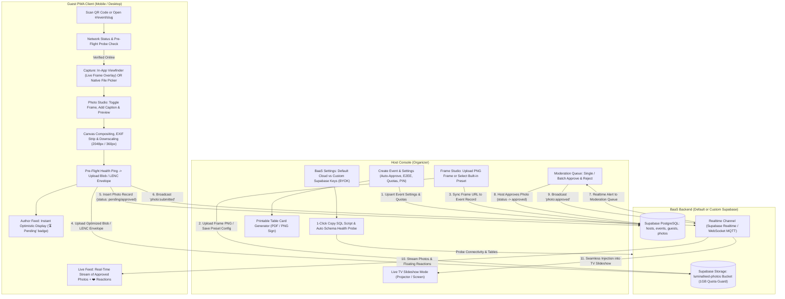

# Architecture & Implementation Plan: LuminaFeed PWA Rebuild

Rebuild **LuminaFeed** into a high-performance, **Online-First** Progressive Web App (PWA) for real-time event photo sharing featuring:
- **Free-Tier Quota Management**: 5 concurrent event limit (for default cloud), 100 photos/event cap (~48MB footprint), 15 photos/guest limit, and 24-hour TTL auto-purge to stay well within Supabase's 1 GB free tier.
- **Online-First Network Engine**: Pre-flight connectivity probes, timeout/retry guards, and live network status indicators (`🟢 Live` / `🟡 Reconnecting` / `🔴 Disconnected`).
- **Dual Camera Capture Engine**: In-app live camera viewfinder with real-time frame overlay + native OS camera/file picker fallback.
- **Hybrid Photo Frame Studio**: Upload custom transparent PNG overlays OR select from built-in preset frames (with custom text overlay), plus the option to run with no overlay / direct photos.
- **Guest Engagement & Social Polish**: Real-time heart/emoji reactions, optional 1-line photo captions, and live attendee counter.
- **Host Management & Printables**: 1-Click Printable QR Table Card / Poster generator, Host PIN security lock, and cascading event deletion.
- **Persistent Guest Sessions**: Seamless auto-resume on refresh/re-scan + 1-tap "Continue as [Name]" fast re-join on logout.
- **Flexible Privacy & Encryption Modes**: Standard high-performance Direct CDN streaming vs. Zero-Knowledge End-to-End Encryption (AES-256-GCM `LENC` envelope) with automatic EXIF GPS stripping.
- **Flexible BaaS Configuration**: Use default pre-configured Supabase backend or supply custom Supabase credentials (BYOK) with a 1-Click SQL Setup script and automated schema health probe.
- **Real-Time Signaling**: Hybrid auto-switch between Supabase Realtime Broadcast and public WebSocket MQTT.
- **Dual Moderation Pipeline**: Auto-approve mode vs. Host Moderation Queue with optimistic local "⏳ Pending Approval" badge for authors.
- **Live Projector Slideshow (TV Mode)**: Full-screen presentation view with live slide injection, customizable transitions, blurred portrait framing, and on-screen QR code onboarding.

---

## 🏛️ System Architecture & Workflow Diagram



---

## 🎯 Finalized Functional Specifications

### 1. Quota & Storage Management (Free-Tier Optimized)
- **100 Photos / Event Default Cap**: ~48 MB storage per event.
- **5 Concurrent Active Events**: ~240 MB total, consuming <25% of Supabase's 1 GB free tier.
- **15 Photos / Guest Quota**: Prevents spamming and ensures fair upload allocation across attendees.
- **24-Hour Ephemeral TTL**: Automatically purges expired events and cascades cloud file deletion from Supabase Storage.
- **Quota Progress Bars**: Visual progress indicators in Host and Guest headers (e.g., `📸 42/100 Photos`).

### 2. Host Tools, Security & Printables
- **Host PIN Lock**: Organizer dashboard actions (event deletion, frame changes, settings) are locked with a secure host PIN.
- **1-Click Printable Table Sign Generator**: Generates high-res printable table cards/posters with the event QR code, custom title, and join instructions.
- **Cascading Event Purge**: Deleting an event cleanly removes all photos, micro-thumbnails, custom frames, and database rows from Supabase.

### 3. Guest Engagement & Social Reactions
- **Real-Time Photo Reactions (❤️ / 🔥 / 🥂 / 🎉)**: Tap to send floating reactions that animate across all connected guest screens and the TV slideshow.
- **Optional Photo Captions**: Guests can attach a short 1-line message displayed in the feed and slideshow.
- **Live Attendee Counter**: Real-time counter showing active participants (e.g., `👥 22 Guests`).

### 4. Online-First Network & Pre-Flight Probing Engine
- **Pre-Upload Health Ping**: Instant (<300ms) probe before uploading to prevent frozen spinners.
- **Live Connection Status Pill**: `🟢 Live` / `🟡 Reconnecting...` / `🔴 Offline`.
- **Upload Timeout & Auto-Retry**: 15s threshold with automatic retry.

### 5. Dual Camera & Photo Studio Engine
- **In-App Live Viewfinder**: Real-time camera feed with live frame overlay and shutter controls.
- **Native File/Camera Fallback**: Standard gallery or OS camera picker.
- **Interactive Preview & Frame Toggle**: Toggle between Framed and Direct Photo.
- **Client Processing Engine ([`photo-engine.js`](file:///d:/a-projects/apps/lumina-feed/client/src/lib/photo-engine.js))**: Canvas compositing, auto EXIF orientation, EXIF GPS stripping, dual JPEG output (2048px @ 88% / 360px @ 75%).

### 6. Hybrid Host Frame Studio
- **Custom PNG Upload**: Upload transparent PNG overlays (portrait 9:16, landscape 16:9, or 4:3 / 1:1).
- **Built-in Presets**: *Polaroid Classic*, *Golden Glamour*, *Neon Celebration*, *Minimalist Modern* with dynamic text.
- **No-Frame Option**: Run events as clean direct photo feeds.

### 7. BaaS & Bring-Your-Own-Keys (BYOK) Architecture
- **Dual-Mode Backend**: Default embedded `.env` credentials vs Custom Supabase Project URL & Anon Key.
- **1-Click SQL Setup Script**: In-app copy button with complete DDL script.
- **Automated Schema Health Probe**: Real-time status indicators (`🟢 Ready`, `⚠️ Missing Tables`, `❌ Error`).
- **Storage-First Manifest Fallback**: JSON manifest fallback (`_events/${slug}.json`) for zero-database setups.

### 8. Full-Screen TV Slideshow Presentation Mode
- **Projector Optimized**: Dark theme, smooth transitions, smart blurred sidebars for portrait photos.
- **Live Slide Injection**: Dynamic queueing of newly approved photos.
- **Floating QR Corner Badge**: On-screen QR code for guests to scan and join during the event.

---

## 📋 Execution Plan & Milestones

| Phase | Milestone | Files Involved |
|---|---|---|
| **Phase 1** | **BaaS BYOK Engine, Quotas & Schema Probe** | [`storage.js`](file:///d:/a-projects/apps/lumina-feed/client/src/lib/storage.js), [`db.js`](file:///d:/a-projects/apps/lumina-feed/client/src/lib/db.js), [`supabase_schema.sql`](file:///d:/a-projects/apps/lumina-feed/supabase_schema.sql) |
| **Phase 2** | **Online Network Engine & Pre-Flight Probe** | [`storage.js`](file:///d:/a-projects/apps/lumina-feed/client/src/lib/storage.js), [`App.svelte`](file:///d:/a-projects/apps/lumina-feed/client/src/App.svelte) |
| **Phase 3** | **Crypto & Privacy Pipeline** | [`crypto.js`](file:///d:/a-projects/apps/lumina-feed/client/src/lib/crypto.js), [`storage.js`](file:///d:/a-projects/apps/lumina-feed/client/src/lib/storage.js) |
| **Phase 4** | **Guest Session Persistence & Identity** | [`db.js`](file:///d:/a-projects/apps/lumina-feed/client/src/lib/db.js), [`App.svelte`](file:///d:/a-projects/apps/lumina-feed/client/src/App.svelte) |
| **Phase 5** | **Host Frame Studio & Printable Sign Generator** | [`App.svelte`](file:///d:/a-projects/apps/lumina-feed/client/src/App.svelte), [`storage.js`](file:///d:/a-projects/apps/lumina-feed/client/src/lib/storage.js) |
| **Phase 6** | **Canvas Frame Compositor & Presets** | [`photo-engine.js`](file:///d:/a-projects/apps/lumina-feed/client/src/lib/photo-engine.js) |
| **Phase 7** | **Guest Camera Viewfinder & Photo Studio** | [`App.svelte`](file:///d:/a-projects/apps/lumina-feed/client/src/App.svelte), [`photo-engine.js`](file:///d:/a-projects/apps/lumina-feed/client/src/lib/photo-engine.js) |
| **Phase 8** | **Real-Time Signaling, Reactions & Moderation Queue** | [`realtime.js`](file:///d:/a-projects/apps/lumina-feed/client/src/lib/realtime.js), [`App.svelte`](file:///d:/a-projects/apps/lumina-feed/client/src/App.svelte) |
| **Phase 9** | **Live TV Slideshow & Polish** | [`App.svelte`](file:///d:/a-projects/apps/lumina-feed/client/src/App.svelte), [`app.css`](file:///d:/a-projects/apps/lumina-feed/client/src/app.css) |
| **Phase 10** | **PWA Verification & Distribution Build** | [`sw.js`](file:///d:/a-projects/apps/lumina-feed/sw.js), [`manifest.json`](file:///d:/a-projects/apps/lumina-feed/manifest.json) |

---

## 🔒 Verification Plan

### Automated Verification
```powershell
npm --prefix client run build
```

### Manual Cross-Device Testing Flow
1. **Quota & TTL Enforcement**: Create 5 events; verify quota progress indicators accurately reflect uploads; verify that reaching 100 photos or 15 guest uploads displays a friendly limit warning.
2. **Printable Sign & Table Card**: Generate a table sign from host console; verify layout and QR scan precision.
3. **Reactions & Captions**: Upload a photo with a caption; trigger floating heart reactions; verify instant real-time sync across devices and TV slideshow.
4. **Connectivity Check**: Simulate offline/slow network; verify pre-flight ping and `🔴 Offline` banner prevent hung uploads.
5. **Security & Encryption**: Test E2EE toggle, `#key=...` URL generation, and in-browser AES-256-GCM decryption.
6. **Capture & Frame Studio**: Test in-app viewfinder with frame overlay vs direct raw capture.
7. **Moderation & TV Slideshow**: Test manual approval queue and real-time slideshow presentation.
